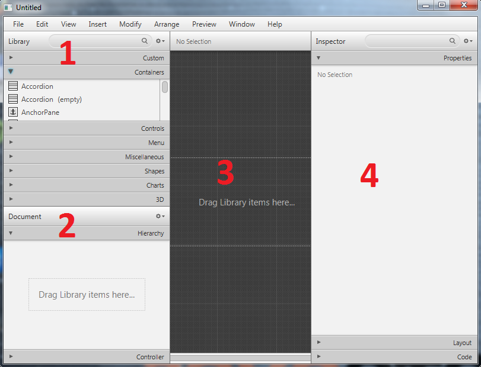
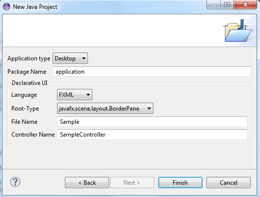
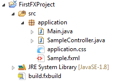
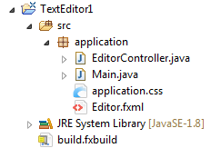
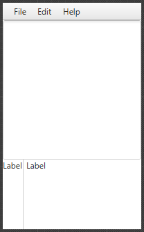
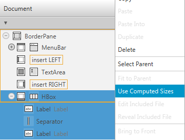
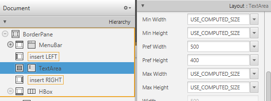

Graficzny interfejs użytkownika
================================

W tej lekcji dowiesz się:

* Czym jest JavaFX
* Jak stworzyć graficzny interfejs użytkownika wykorzystując Scene Buildera
* Co oznacza wzorzec MVC
* Jak wygląda język FXML
* Jak stworzyć prosty projekt w JavieFX

JavaFX
---------

.. image:: 06_fx/javafx.png
    :align: center

JavaFX jest technologią, która pozwala na tworzenie bogatych graficznie interfejsów użytkownika do aplikacji napisanych w Javie. W początkowym zamyśle miała to być technologia przeznaczona głównie do tworzenia tzw. Rich Internet Application, któe miałyby rywalizować z Adobe Flash, czy Microsoft Silverlight. Ostatecznie oprócz wspomnianej funkcji stała się także rekomendowaną biblioteką do tworzenia graficznego interfejsu użytkownika aplikacji desktopowych napisanych w języku Java. Trwają także prace nad tym, aby aplikacje napisane w JavieFX można portować na platformy Android oraz iOS (zasada write once run everywhere).

Głównym narzędziem, który posłuży nam do budowania GUI (graphical user interface) będzie Scene Builder - oficjalne narzędzie rozwijane przez Oracle, które pozwala tworzyć interfejs użytkownika za pomocą przyjaznego edytora WYSIWYG.

Scene Builder 2.0 - pierwszy rzut oka
^^^^^^^^^^^^^^^^^^^^^^^^^^^^^^^^^^^^^^

W Scene Builderze możemy wyróżnić kilka głównych obszarów roboczych, z których będziemy korzystali. Zgodnie z oznaczeniami na powyższym zrzucie ekranu są to:

#. **Library** - 
#. **Document** - 
#. **Podgląd** - 
#. **Inspector** - 

**Ćwiczenie**
Zapoznaj się przez 5 minut z narzędziem Scene Builder. Spróbuj przeciągnąć różne elementy z sekcji Library do obszaru roboczego lub bezpośrednio do sekcji Document. Kliknij na wybrane z przeciągniętych elementów i spróbuj pozmieniać ustawienia w sekcji Inspector po prawej stronie.

Pierwszy projekt JavaFX
------------------------
W celu utworzenia swojego pierwszego projektu w JavieFX przejdź do eclipse i utwórz nowy projekt JavaFX (PPM -> New -> Other -> JavaFX Project).

.. image:: 06_fx/fx1.png
    :align: center

Następnie wpisz dowolną nazwę projektu i klikając przycisk Next przejdź do ostatniej zakładki kreatora projektu, gdzie wybierz Language jako **FXML**.

Wybierz Finish, po czym projekt zostanie utworzony.

Omówienie domyślnego projektu
^^^^^^^^^^^^^^^^^^^^^^^^^^^^^^
Eclipse domyślnie wygeneruje dla nas prosty szablon projektu JavaFX, który już na pierwszy rzut oka różni się od tego co znaliśmy do tej pory.

* Main.java to główna klasa, od której rozpoczyna się działanie aplikacji.
* Sample.fxml zawiera definicję tego z jakich layoutów oraz kontrolek zkłada się widok naszej aplikacji - w skrócie jak wygląda
* application.css to definicja stylów CSS dla naszej aplikacji. Z pewnością słyszałeś już o nich w przypadku stron internetowych
* SampleController.java to dodatkowa klasa, która występuje w architekturze MVC (Model View Controller)

**Model View Controller** jest najpopularniejszym wzorcem architektonicznym wykorzystywanym w tworzeniu aplikacji. Jego głównym zamysłem jest to, żeby oddzielić od siebie definicję tego jak aplikacja wygląda od tego co robi. W komunikacji pomiędzy tymi dwoma elementami występuje kontroler, który odpowiednio przekazuje informacje od użytkownika (GUI aplikacji) do modelu danych i w drugą stronę.

Zaletą takiego podejścia jest to, że aplikacje można rozwijać równolegle i lepiej dzielić obowiązki w zespole programistów. Jeżeli ktoś jest silniejszy tworzeniu tzw. backendu może zająć się programowaniem logiki biznesowej, natomiast osoby o lepszym zmyśle estetycznym mogą się poświęcić stworzeniu frontendu aplikacji.

Definiowanie widoku
--------------------
Widok naszej aplikacji będziemy definiowali w języku XML i formie plików o rozszerzniu .fxml. Na szczęście nie musimy wszystkiego pisać ręcznie, bo kod zostanie wygenerowany na podstawie tego co zrobimy w Scene Builderze.

Żeby przejść do edycji pliku fxml kliknij na niego prawym przyciskiem myszy w eclipse i wybierz opcję Open with SceneBuilder.

.. image:: 06_fx/openwith.png
    :align: center

Jeżeli nic nie zmieniałeś w ustawieniach projektu, to plik Sample.fxml powinien mieć następującą postać:

*plik Sample.fxml*

.. code-block:: xml
    :linenos:

    <?xml version="1.0" encoding="UTF-8"?>
        
    <?import javafx.scene.layout.BorderPane?>

    <BorderPane xmlns:fx="http://javafx.com/fxml" fx:controller="application.SampleController">
        <!-- TODO Add Nodes -->
    </BorderPane>

**BorderPane** to główny węzeł naszego widoku. Jest to zwyczajna klasa, którą możesz znaleźć w dokumentacji Javy i której obiekt możesz utworzyć także bezpośrednio w kodzie napisanym w Javie. Jak widzisz klasa ta jest najpierw zaimportowana z pakietu *javafx.scene.layout*. Warto zwrócić uwagę także na atrybut xmlns (skrót od XML Namespace), czyli przestrzeni nazw, z której korzystamy - jeżeli jej nie zdefiniujemy, nasza aplikacja się nie uruchomi, ponieważ kod zostanie uznany za niezgodny ze standardem. atrybut *fx:controller="application.SampleController"* wskazuje klasę kontrolera powiązaną z tym konkretnym plikiem widoku - w tym przypadku jest to nasza klasa *SampleController*.

W Scene builderze zauważysz, że kod XML ma odzwierciedlenie w sekcji Document Hierarchy, gdzie znajduje się struktura naszego widoku w postaci drzewa węzłów.

.. image:: 06_fx/dochier.png
    :align: center

Edytor WYSIWYG
^^^^^^^^^^^^^^^
Scene Builder to wygodny wdytor w stylu "przeciągnij i upuść". Możesz w nim przeciągnąć kilka kontrolek na nasz główny layout, czyli BorderPane (bezpośrednio do sekcji Document Hierarchy) lub na obszar roboczy. Wszelkie zmiany będą aktualizowane automatycznie.

Spróbujmy teraz zaprojektować bardzo prosty edytor tekstowy, w którym muszą znaleźć się takie elementy jak:

* pasek menu kontekstowego
* główne pole tekstowe
* pasek podliczający ilość wprowadzonych znaków oraz ilość słów w tekście

Makieta aplikacji:

.. image:: 06_fx/mockup.png
    :align: center

Struktura projektu eclipse:

Otwórz plik fxml w Scene Builderze i dobierz odpowiednie kontrolki, które umieścisz na głównym layoucie aplikacji (BorderPane). Kontrolki, które należy wykorzystać to:

* MenuBar - pasek nawigacyjny, na którym można umieszczać elementy typu MenuItem
* TextArea - pole tekstowe, w którym można wprowadzać wiele wierzy tekstu
* Label - etykiety tekstowe
* Separator - pozwala oddzielić kontrolki od siebie

Hierarchia dokumentu FXML w Scene Builderze:

.. image:: 06_fx/hierarchy1.png
    :align: center

Jak widzisz etykiety w dolnej części aplikacji opakowane zostały w dodatkowy layout typu HBox.

.. note::
    Layouty przy tworzeniu graficznego interfejsu użytkownika służą do ustalenia pewnego porządku dodawanych do nich kontrolek. BorderPane pozwala ustawić elementy na krawędziach (góra, dół, lewo, prawo lub środek) natomiast HBox ustawia kontrolki w jednym wierszu jeden obok drugiego. Istnieje dużo więcej layoutów, któe możesz przejrzeć w sekcji containers Scene Buildera. Ikonki umieszczone przy poszczególnych z nich oraz nazwy bardzo dobrze opisują to w jaki sposób możemy je wykorzystać. Layouty mogą być także zagnieżdżane jeden w drugim tak jak w naszym przykładzie, gdzie HBox jest węzłem w layoucie typu BorderPane.

Problem jaki pojawia się w tym momencie to domyślne parametry kontrolek, które sprawiają, że aplikacja nie wygląda najlepiej:

Możemy to na szczęście dosyć łatwo zmodyfikować w sekcji Layout scene buildera (po prawej stronie po kliknięciu na dowolny element), a także wykorzystując opcję dostosowania do domyślnego rozmiaru węzłów potomnych.

Po wcześniejszym zaznaczeniu HBoxa oraz elementów do niego dodanych wybierz opcję Use Computed Sizes, co pozwoli na pozbycie się zbędnej przestrzeni przy naszych etykietach:

Teraz kliknij na obiekt TextArea i w ustawieniach Layout po prawej stronie ustaw jego wysokość i szerokość (Pref Width i Pref Height):

W tym momencie po zapisaniu naszego pliku fxml jego kod powinien wyglądać następująco:

*plik Editor.fxml*

.. code-block:: xml
    :linenos:

    <?xml version="1.0" encoding="UTF-8"?>

    <?import javafx.scene.control.*?>
    <?import java.lang.*?>
    <?import javafx.scene.layout.*?>
    <?import javafx.scene.layout.BorderPane?>

    <BorderPane xmlns:fx="http://javafx.com/fxml/1" xmlns="http://javafx.com/javafx/8"
        fx:controller="application.SampleController">
        <top>
            <MenuBar BorderPane.alignment="CENTER">
                <menus>
                    <Menu mnemonicParsing="false" text="File">
                        <items>
                            <MenuItem mnemonicParsing="false" text="Close" />
                        </items>
                    </Menu>
                    <Menu mnemonicParsing="false" text="Edit">
                        <items>
                            <MenuItem mnemonicParsing="false" text="Delete" />
                        </items>
                    </Menu>
                    <Menu mnemonicParsing="false" text="Help">
                        <items>
                            <MenuItem mnemonicParsing="false" text="About" />
                        </items>
                    </Menu>
                </menus>
            </MenuBar>
        </top>
        

            <TextArea prefHeight="400.0" prefWidth="500.0"
                BorderPane.alignment="CENTER" />
        

        <bottom>
            <HBox BorderPane.alignment="CENTER">
                <children>
                    <Label text="Label" />
                    <Separator orientation="VERTICAL" />
                    <Label text="Label" />
                </children>
            </HBox>
        </bottom>
    </BorderPane>

Jak widać każdy element, który dodaliśmy w Scene Builderze ma tutaj swoje odzwierciedlenie w postaci węxła XML. Widoczne są także ustawienia poszczególnych elementów, np. wysokość i szerokość TextArea postaci *TextArea prefHeight="400.0" prefWidth="500.0"*.

W tym momencie warto zobaczyć jak nasza aplikacja będzie wyglądała po uruchomieniu. Co ciekawe jeżeli chcemy podejrzeć tylko wygląd bez funkcjonalności, możemy to zrobić bezpośrednio z poziomu Scene Buildera korzystając z opcji Preview -> Show Preview in Window (Ctrl + P).

.. image:: 06_fx/preview.png
    :align: center

Jak widzisz widok aplikacji można więc definiować nawet nie znając języka Java.

Architektura aplikacji
-----------------------
Czas wrócić jednak do tego, aby nasza aplikacja dała się uruchomić z poziomu eclipse jako aplikacja Javy. Zacznijmy od poprawki w nazwie pliku fxml wczytywanym w klasie Main:

.. code-block:: java
    :linenos:

    package application;

    import javafx.application.Application;
    import javafx.fxml.FXMLLoader;
    import javafx.scene.Scene;
    import javafx.scene.layout.BorderPane;
    import javafx.stage.Stage;

    public class Main extends Application {
        @Override
        public void start(Stage primaryStage) {
            try {
                BorderPane root = (BorderPane) FXMLLoader.load(getClass()
                        .getResource("Editor.fxml"));
                Scene scene = new Scene(root, 400, 400);
                scene.getStylesheets().add(
                        getClass().getResource("application.css").toExternalForm());
                primaryStage.setScene(scene);
                primaryStage.show();
            } catch (Exception e) {
                e.printStackTrace();
            }
        }

        public static void main(String[] args) {
            launch(args);
        }
    }

Omówmy ten kod linijka po linijce:

#. Wiersze 1-8 to deklaracja pakietu oraz import bibliotek, które później wykorzystujemy
#. W linijce 9 widzimy, że nasza klasa Main rozszerza klasę Application. Oznacza to, że jest to główna klasa aplikacji napisanej w JavieFX i to od niej rozpocznie się działanie naszej aplikacji.
#. Klasa Application posiada jedną abstrakcyjną metodę *start()*, którą musimy przesłonić (Override). Jako jej argument przekazany zostanie obiekt Stage, który zostanie utworzony przez wirtualną maszynę. **Stage** to okno naszej aplikacji.
#. W wierszach 13-14 wczytujemy nasz widok za pomocą specjalnej klasy FXMLLoader i metody *load()*. Przetwarza ona plik XML i na podstawie zawartych w nim definicji tworzy obiekty, które będą odzwierciedlone w kodzie Javy.
#. W 15 wierzu tworzymy obiekt **Scene**, który dodamy do naszego okna (Stage) w wierszu 18. Scene to klasa reprezentująca główny kontener z widokiem aplikacji, do któego możemy dodawać inne elementy takie jak layouty, czy konkretne kontrolki.
#. W 16 i 17 wierzu wczytujemy style CSS, które aplikujemy do naszej sceny. Ponieważ na tę chwilę plik *application.css* jest pusty, nie będzie to miało wpływu na wygląd naszej aplikacji.
#. W metodzie *main()* wywołujemy metodę *launch()* ta z kolei odpowiada za cykl życia aplikacji JavaFX, czyli m.in. wywołanie metody *start()*.

Ostateczna hierarchia widoku w JavieFX wygląda więc następująco:

.. image:: 06_fx/viewh.png
    :align: center

Pozostaje nam jeszcze jedna rzecz do poprawy. Przy próbie uruchomienia programu otrzymujemy błąd *Caused by: java.lang.ClassNotFoundException: application.SampleController* - jest on spowodowany tym, że w pliku fxml nie zmieniliśmy klasy kontrolera (fx:controller) po zmianie nazwy pliku z klasą (EditorController).

W Scene Builderze można to zrobić także w sekcji Document rozwijając zakładkę Controller. Nazwę klasy kontrolera należy podać również ze ścieżką uwzględniającą pakiet (tzw. fully qualified name).

.. image:: 06_fx/fxcontroller.png
    :align: center

Definicja BorderPane w pliku fxml powinna więc wyglądać teraz następująco:

.. code-block:: xml
    :linenos:

    <BorderPane xmlns="http://javafx.com/javafx/8" xmlns:fx="http://javafx.com/fxml/1"
        fx:controller="application.EditorController">

W tym momencie powinniśmy mieć już możliwość uruchomienia naszej aplikacji z poziomu eclipse a naszym oczom powinien ukazać się widok analogiczny do podglądu, który widzieliśmy wcześniej w Scene Builderze.

.. attention::
    Jeżeli przy próbie uruchomienia aplikacji nadal pojawia się jakiś błąd związany z dokumentem fxml, a jesteś pewny, że zapisałeś go w Scene Builderze, otwórz go w eclipse, a to pomoże go odświeżyć. Jeżeli nie otworzysz pliku, który przed chwilą edytowałeś w innym edytorze, eclipse może korzystać ze starszej wersji dokumentu, który wczytał już do pamięci.

FXML a klasa kontrolera
------------------------
Nasza aplikacja daje się już w tym momencie uruchomić, jednak w żaden sposób nie możemy odwołać się do pola tekstowego w naszym kodzie Javy. Zgodnie z architekturą MVC powinniśmy móc pobierać i wysyłać informacje do kontrolek zdefiniowanych w widoku poprzez klasę kontrolera. W tym celu musimy zdefiniować w dokumencie fxml dodatkowe atrybuty **fx:id** dla każdej z kontrolek, a najłatwiej będzie to zrobić przełączając najpierw widok w sekcji Document Hierarchy na fx:id właśnie.

.. image:: 06_fx/fxid.png
    :align: center

Nadając fx:id pamiętaj, żeby były to znaczące nazwy, ponieważ będą to jednocześnie nazwy zmiennych w kodzie Javy. fx:id ustawić klikając dwukrotnie obok danej kontrolki w sekcji Document Hierarchy lub wprowadzając ją w sekcji Code (prawe menu).

.. image:: 06_fx/fxid2.png
    :align: center

fx:id i klasa kontrolera
-------------------------
Pobranie wartości z kontrolki
Ustawienie tekstów kontrolek

Struktura widoku
Język FXML
Prosty przykład aplikacji

http://javafxports.org/page/What_is_JavaFXPorts