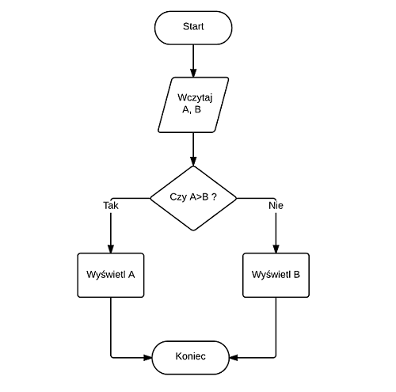

Struktury sterujące i pętle
============================

W tej lekcji dowiesz się:

* W jaki sposób sterować wykonaniem programu
* Czym są pętle while, do while, for i for each oraz jak ich używać

Struktury sterujące
--------------------
Struktury sterujące to specjalne elementy języka, które pozwalają na wybór odpowiedniej ścieżki w aplikacji. Przykładowo jeżeli chcemy porównać ze sobą dwie liczby całkowite, musimy sprawdzić warunek, a następnie podjąć decyzję, co w wyniku tego porównania wyświetlić na ekranie:

Co więcej warunki takie mogą być bardziej rozgałęzione, czyli np. możemy sprawdzić, czy wczytana liczba jest większa, mniejsza, czy równa 0 itd.

Instrukcja if else
-------------------
Podstawową strukturą sterującą w większości języków programowania, w tym także w Javie jest instrukcja if. W swojej najprostszej formie odpowiada ona sytuacji, którą widzisz na wcześniejszym diagramie - pozwala sprawdzić prosty warunek, który w wyniku powinien zwrócić wartość typu boolean, czyli true lub false i na podstawie tego zadecydować, co nasz program zrobi dalej.

Ogólna konstrukcja bloku if wygląda następująco:

*plik Main.java*

.. code-block:: java
    :linenos:

    if(warunek) {
      //działania, gdy warunek zwraca true
    } else {
      //działania, gdy warunek zwraca false
    }

**Ćwiczenie** *(5 minut)*

    Zaimplementuj program, który służy do porównywania dwóch liczb całkowitych zgodny z przedstawionym wyżej diagramem. Wyświetl na ekranie komunikat o tym, która liczba jest większa od której. Liczby wczytaj do wcześniej zadeklarowanych zmiennych.

.. code-block:: java
    :linenos:

    public class Main {
        public static void main(String[] args) {
            int a = 10;
            int b = 11;

            if (a > b) {
                System.out.println("A jest większe od B " + a + " > " + b);
            } else {
                System.out.println("B jest większe od A " + b + " > " + a);
            }
        }
    }

W nawiasie występującym po instrukcji if musi znajdować się wyrażenie, które w wyniku zwraca true lub false. Nie musi to być jedynie porównanie dwóch liczb tak jak w powyższym przykładzie, ale także bardziej złożony warunek np. wykorzystujący operatory logiczne && lub ||.

W przypadku kodu tak prostego jak ten powyżej, gdzie w bloku if oraz else pomiędzy nawiasami klamrowymi znajduje się jedynie jedna instrukcja (np. *System.out.print()*), nawiasy klamrowe można pominąć, czyli uprościć nasz kod do postaci:

.. code-block:: java
    :linenos:

    public class Main {
        public static void main(String[] args) {
            int a = 10;
            int b = 11;

            if (a > b)
                System.out.println("A jest większe od B " + a + " > " + b);
            else
                System.out.println("B jest większe od A " + b + " > " + a);
        }
    }

W praktyce jednak stosowanie klamer podnosi czytelność kodu, więc warto je stosować nawet w najbardziej trywialnych sytuacjach.

Możliwe, że zauważyłeś, że powyższy kod ma jedną poważną wadę. W przypadku, gdy liczby a i b będą identyczne, to ich porównanie za pomocą znaku ostrej nierówności zwróci false. W takiej sytuacji wyświetlony zostanie komunikat o tym, że liczba B jest większa od A, a to oczywiście nie jest prawdą.

W takim przypadku możemy zastosować np. zagnieżdżone instrukcje if.

**Ćwiczenie** *(5 minut)*

    Popraw wcześniejszy kod w taki sposób, aby najpierw sprawdzić, czy liczby są równe, a dopiero gdy nie są, porównaj je operatorem nierówności. Wykorzystaj zagnieżdżone warunki if i w każdej sytuacji wyświetl na ekranie stosowny komunikat.

.. code-block:: java
    :linenos:

    public class Main {
        public static void main(String[] args) {
            int a = 10;
            int b = 11;

            if (a == b) {
                System.out.println("Liczby A i B są równe " + a + " = " + b);
            } else {
                if (a > b) {
                    System.out.println("A jest większe od B " + a + " > " + b);
                } else {
                    System.out.println("B jest większe od A " + b + " > " + a);
                }
            }
        }
    }

Powyższy kod posiada jedną, aczkolwiek istotną wadę. Nawet pojedynczo zagnieżdżone bloki instrukcji if wpływają w znaczącym stopniu na zmniejszenie czytelności kodu i w ogólności dobrą praktyką jest unikanie takich sytuacji. Najprościej jest to zrobić korzystając z nieco bardziej złożonej instrukcji if else:

.. code-block:: java
    :linenos:

    if (warunek1) {
        //instrukcje gdy warunek1 jest true
    } else if (warunek2) {
        //instrukcje gdy warunek2 jest true
    } else if (warunek3) {
        //instrukcje gdy warunek3 jest true
    } else {
        //instrukcje gdy żadny z warunków nie był true
    }

Korzystając z dodatkowych warunków w postaci *else if* możemy w dowolny sposób rozgałęzić działanie naszej aplikacji bez konieczności zagnieżdżania warunków if i obniżania czytelności kodu. Pamiętaj, że blok z warunkiem2 wykona się tylko wtedy, gdy warunek1 zwróci false, analogicznie warunek3, gdzy warunek2 oraz warunek1 będą nieprawdziwe.

**Ćwiczenie** *(5 minut)*

    Przerób wcześniejszy kod z porównywaniem liczb w taki sposób, aby wyeliminować zagnieżdżone warunki if.

.. code-block:: java
    :linenos:

    public class Main {
        public static void main(String[] args) {
            int a = 12;
            int b = 11;

            if (a == b) {
                System.out.println("Liczby A i B są równe " + a + " = " + b);
            } else if (a > b) {
                System.out.println("A jest większe od B " + a + " > " + b);
            } else {
                System.out.println("B jest większe od A " + b + " > " + a);
            }
        }
    }

Zauważ, że ponieważ wiemy, że istnieją tylko trzy możliwe wyniki porównania dwóch liczb, to w ostatnim bloku nie musimy zapisywać *else if(a<b)* a wystarczy jedynie samo *else* - jest to jedyny możliwy wynik jaki pozostał.

Struktura sterująca switch
---------------------------
Powyżej pokazana struktura if-else-if pomimo iż bardziej czytelna od zagnieżdżonych warunków, to jednak w sytuacji, gdy mamy np. menu aplikacji składające się z 10 możliwych opcji, nie wydaje się najlepszym rozwiązaniem. W większości języków programowania rozwiązaniem tego problemu jest bardziej złożona struktura **switch**.

W odróżnieniu od instrukcji if, w strukturze switch operujemy nie na warunkach zwracających wartość true lub false, ale na liczbach całkowitych. Od Javy w wersji 7 możliwe jest także stosowanie w miejsce liczb napisów typu String.

Schematyczna budowa switch wygląda jak poniżej:
::

    //wybrana opcja musi być typu całkowitoliczbowego lub być wartością typu String
    switch (wybrana_opcja) {
        case wartość1:
            //instrukcje, gdy wartość1 jest równa wartości wybrana_opcja
            break;
        case wartość2:
             //instrukcje, gdy wartość2 jest równa wartości wybrana_opcja
            break;
        case ...
        default:
            //instrukcje, gdy żaden z wcześniejszych warunków nie pasuje do wybrana_opcja
            //odpowiednik ostatniego bloku else z instrukcji if-else-if
    }

Istotne w powyższym kodzie jest zastosowanie instrukcji break. Jeżeli jej nie zastosujesz w danym bloku case, wtedy wykonane zostaną także instrukcje z innych bloków case znajdujących się poniżej (aż do napotkania break). W bloku default nie jest to wymagane, ponieważ jest on ostatnim w całej konstrukcji i nie musimy niczego przerywać.
Dzięki instrukcji switch możemy zbudować w wygodny sposób proste menu w swojej aplikacji w stylu:

.. image:: 03_sterowanie/library.png
    :align: center

**Ćwiczenie** *(10 minut)*

    Napisz prostą aplikację, w której utworzysz jedną zmienną całkowitoliczbową i przypiszesz do niej wartość z zakresu od 1 do 10. Następnie stwórz blok switch, w którym na podstawie wybranej opcji wyświetlisz wcześniej zainicjowaną zmienną podniesioną do 1, 2, 3 lub 4 potęgi.

.. code-block:: java
    :linenos:

    public class Exponential {
        public static void main(String[] args) {
            int number = 5;

            int option = 2;

            switch (option) {
            case 1:
                System.out.println(number + " do potęgi 1 = " + number);
                break;
            case 2:
                System.out.println(number + " do potęgi 2 = " + number*number);
                break;
            case 3:
                System.out.println(number + " do potęgi 3 = " + number*number*number);
                break;
            case 4:
                System.out.println(number + " do potęgi 4 = " + number*number*number*number);
                break;
            default:
                System.out.println("Wybrano niepoprawną opcję");
            }
        }
    }

Pętle while i do while
-----------------------
W pierwszej części kursu dowiedziałeś się, że w Javie istnieją specjalne struktury danych, które pozwalają przechowywać wiele wartości tego samego typu, które nazwaliśmy tablicami. W tym miejscu powrócimy do nich na chwilę, aby pokazać, że ich przetwarzanie, czy wyświetlanie może być znacznie krótsze i do każdego elementu tablicy nie musimy odwoływać się osobno tak jak do zwykłych zmiennych.

Dwa pierwsze rodzaje pętli, które omówimy to **while** oraz **do while**. Różnica między nimi jest subtelna, aczkolwiek wpływa w znaczący sposób na to co dzieje się w naszym programie. Ogólna postać obu pętli wygląda jak poniżej:

.. code-block:: java
    :linenos:

    //pętla while
    while (warunek) {
        //instrukcje, które będą powtarzane tak długo, dopóki warunek zwraca true
    }

    //pętla do while
    do{
        //instrukcje, które będą się wykonywały tak długo, dopóki warunek zwraca true
    } while(warunek);

Różnica pomiędzy dwoma wyżej pokazanymi rodzajami pętli polega na tym, że w przypadku zwykłej pętli while warunek jest sprawdzany przed rozpoczęciem ciała pętli, więc jeżeli warunek nie będzie prawdziwy, to zawartość pętli nie wykona się ani razu. W przypadku pętli do while mamy pewność, że instrukcje w jej ciele wykonają się co najmniej raz, ponieważ warunek sprawdzany jest dopiero na końcu.
W miejscu wyrażenia, które w powyższym kodzie nazwaliśmy jako *warunek* należy wstawić dowolną zmienną typu boolean lub wyrażenie logiczne zwracające true lub false.

**Ćwiczenie** *(10 minut)*

    Napisz program, w którym zadeklarujesz tablicę 50 liczb całkowitych. Wypełnij ją przy pomocy pętli while wartościami od 1 do 50, a następnie wyświetl jej kolejne elementy za pomocą pętli do while.

*plik Loops1.java*

.. code-block:: java
    :linenos:

    public class Loops1 {
        public static void main(String[] args) {
            int[] array = new int[50];

            int i = 0; // licznik pętli

            // wypełniamy tablicę
            while (i < array.length) {
                array[i] = i + 1;
                i = i + 1;
            }

            // zerujemy licznik
            i = 0;
            
            //wyświetlamy wartości
            do {
                System.out.print(array[i] + "; ");
                i = i + 1;
            } while (i < array.length);
        }
    }

Do rozwiązania należało zastosować scenariusz, który będzie się często powtarzał w niemal każdej aplikacji, która korzysta z tablic:

1. Utworzenie tablicy
2. Zainicjowanie licznika pętli
3. Wypełnienie kolejnych komórek tablicy wartościami (while)
4. Wykonanie operacji na danych w tablicy (pętla do while)

W praktyce dużo częściej stosuje się pętle while, ponieważ są po prostu bardziej intuicyjne

Inkrementacja i dekrementacja
------------------------------
Operacją, która w przypadku pętli będzie się bardzo często powtarzała jest zwiększanie lub zmniejszanie zmiennej reprezentującej licznik o 1. W programowaniu jest to tak często wykorzystywane, że powstały specjalne operatory, które skracają zapis, a po pewnym czasie stają się nawykiem przy pisaniu pętli.

**Inkrementacja** to zwiększenie wartości zmiennej o 1, natomiast **dekrementacja** to zmniejszenie o 1. Inkrementację oznaczamy znakiem podwójnego plusa (++), natomiast dekrementację podwójnego minusa (--).

W praktyce wygląda to następująco:

.. code-block:: java
    :linenos:

    int a = 1;
    a++;
    //a ma teraz wartość 2
    a--;
    //a ma teraz znowu wartość 1

Dodatkowo istnieją dwa rodzaje powyższych operatorów. W formie przyrostkowej, czyli np. a++ oraz przedrostkowej, czyli ++a. Różnica polega na tym, kiedy wykonywane jest faktyczne zwiększenie, czy zmniejszenie wartości o 1. W przypadku inkrementacji przyrostkowej wartość zmiennej jest zwiększana dopiero po wykonaniu operacji, w której zmienna ta występuje.

Najłatwiej zobrazować to prostym przykładem:

.. code-block:: java
    :linenos:

    int x = 1;
    System.out.println(x); //wyświetla 1
    System.out.println(x++); //również wyświetla 1, ale po wyświetleniu zwiększa wartość x do 2
    System.out.println(x); //wyświetla 2

Analogicznie dla inkrementacji przedrostkowej:

.. code-block:: java
    :linenos:

    int x = 1;
    System.out.println(x); //wyświetla 1
    System.out.println(++x); //najpierw zwiększa wartość x do 2 i wyświetla 2
    System.out.println(x); //wyświetla 2

W pętlach znajduje to takie zastosowanie, że możemy pominąć ręczne zwiększanie licznika w postaci *i = i+1* i zapisać *i++*, dodatkowo w niektórych sytuacjach bezpośrednio przy sprawdzaniu warunku, np.:

.. code-block:: java

    int i=0;
    while(i++ < 10) { ... }

**Ćwiczenie** *(5 minut)*

    Przerób poprzedni przykład z wypełnianiem tablicy w taki sposób, aby wykorzystać operator inkrementacji. Dodatkowo wartości w tablicy wyświetl od końca wykorzystując dekrementację.

.. code-block:: java
    :linenos:

    public class Loops1Increment {
        public static void main(String[] args) {
            int[] array = new int[50];

            int i = 0; // licznik pętli

            // wypełniamy tablicę
            while (i < array.length) {
                array[i] = i + 1;
                i++;
            }

            // przypisujemy do licznika ostatni indeks tablicy
            i = array.length-1;
            
            //wyświetlamy wartości
            do {
                System.out.print(array[i] + "; ");
            } while (i-- > 0);
        }
    }

Pętla while nie zmieniła się znacząco, jedynie zamieniliśmy sposób zwiększania zmiennej i. W pętli do while zastosowaliśmy dekrementacją, a dodatkowo zmieniliśmy warunek, na taki, który pozwala nam wyświetlać wartości od ostatniego indeksu tablicy, do pierwszego (czyli 0 zgodnie z indeksowaniem tablic).

Pętle for i for each
---------------------
Pętle for i for each to dwa kolejne rodzaje pętli, które idealnie znajdują zastosowanie w przypadku kolekcji danych o znanych z góry rozmiarach, czyli np. pętlach. Ich specyficzna konstrukcja sprawia, że powinniśmy je stosować przede wszystkim w sytuacjach, gdy chcemy przeglądnąć całą kolekcję elementów.

Schematyczna budowa pętli for:

.. code-block:: java
    :linenos:

    for(inicjalizacja_licznika; warunek_stopu; zmiana_licznika) {
        //operacje
    }

Zwróć uwagę, że w nawiasach okrągłych znajdują się trzy elementy, które są oddzielone od siebie średnikami. W sytuacji, gdy chcielibyśmy uzupełnić tablicę o rozmiarze 10 liczbami 10, 20, 30, ..., 100, można to zrobić w następujący sposób:

.. code-block:: java
    :linenos:

    public class ForLoop {
        public static void main(String[] args) {
            int[] array = new int[10];
            
            for(int i=0; i < array.length; i++) {
                array[i] = (i+1)*10;
            }
        }
    }

W porównaniu do pętli while i do while zapis taki staje się bardziej czytelny, ponieważ wszystkie elementy bezpośrednio związane z pętlą, czyli zmienna licznika i warunek końca pętli są zawarte bezpośrednio w deklaracji pętli obok siebie. Będzie to przydatne, gdy kod w pętli będzie nieco bardziej rozbudowany.

Istnieje także odmiana pętli for, która przeznaczona jest wyłącznie do operacji na kolekcjach, gdzie znacząco uproszczono kwestie związane z licznikiem, czy jakimikolwiek warunkami stopu. Jedynym zadaniem pętli for each, o której mowa, jest przejście po wszystkich elementach kolekcji.

Schematyczna budowa pętli for each:

.. code-block:: java

    for(typ_zmiennej zmienna: kolekcja) {
        operacje na zmiennej
    }

Typ zmiennej musi być zgodny z typem kolekcji (czyli np. tablicy), ponieważ w kolejnych iteracjach przypisywana będzie do niej kolejna jej wartość.

Przykładowo dodajmy do poprzedniego przykładu opcję wydruku danych na ekranie z użyciem pętli for each:

.. code-block:: java
    :linenos:

    public class ForLoop {
        public static void main(String[] args) {
            int[] array = new int[10];
            
            for(int i=0; i < array.length; i++) {
                array[i] = (i+1)*10;
            }
            
            for(int number: array) {
                System.out.print(number + "; ");
            }
        }
    }

Ponieważ nasza tablica była typu int[] to zmienna *number* została zadeklarowana jako int. Możemy ją wykorzystać następnie w naszej pętli.

.. attention::
    Pamiętaj, że pętlę for each najlepiej jest stosować wyłącznie do operacji odczytu kolekcji, a nie jej modyfikacji. Do zmiennej deklarowanej w pętli przypisywana jest w rzeczywistości kopia wartości (lub referencji obiektu) przechowywanej w kolekcji, więc modyfikując ją nie modyfikujesz oryginalnej wartości.

Ćwiczenie podsumowujące
------------------------
Napisz program w którym wyświetlisz na ekranie zawartość tablicy dwuwymiarowej o rozmiarach NxN (gdzie rozmiar N jest wartością przechowywaną w zmiennej, którą można modyfikować). Tablica powinna być wypełniona znakami "0" (zero), jedynie na krawędziach oraz przekątnych powinny znajdować się znaki "X". Do wypełnienia tablicy zastosuj pętle for, natomiast do wyświetlenia jej zawartości pętle while. Używaj w kodzie tam gdzie to możliwe operatorów inkrementacji.
Przykładowy wydruk programu:

.. code-block:: java

    X X X X X X X X 
    X X 0 0 0 0 X X 
    X 0 X 0 0 X 0 X 
    X 0 0 X X 0 0 X 
    X 0 0 X X 0 0 X 
    X 0 X 0 0 X 0 X 
    X X 0 0 0 0 X X 
    X X X X X X X X 

*plik Zad1.java*

.. code-block:: java
    :linenos:

    public class Zad1 {
        public static void main(String[] args) {
            int n = 8;
            char[][] array = new char[n][n];

            //wypełniamy tablicę
            for (int i = 0; i < n; i++) {
                for (int j = 0; j < n; j++) {
                    //wypełnienie X na krawędziach tablicy
                    if (i == 0 || j == 0 || i == n - 1 || j == n - 1) {
                        array[i][j] = 'X';
                    //wypełnienie X na przekątnych
                    } else if (i == j || i == n - j - 1) {
                        array[i][j] = 'X';
                    //wypełnienie 0 w pozostałych miejscach
                    } else {
                        array[i][j] = '0';
                    }
                }
            }

            //liczniki pętli
            int i = 0, j = 0;
            //wyświetlanie tablicy
            while (i < n) {
                while (j < n) {
                    System.out.print(array[i][j] + " ");
                    j++;
                }
                j = 0;
                System.out.println(); //nowa linia na końcu wiersza
                i++;
            }
        }
    }
