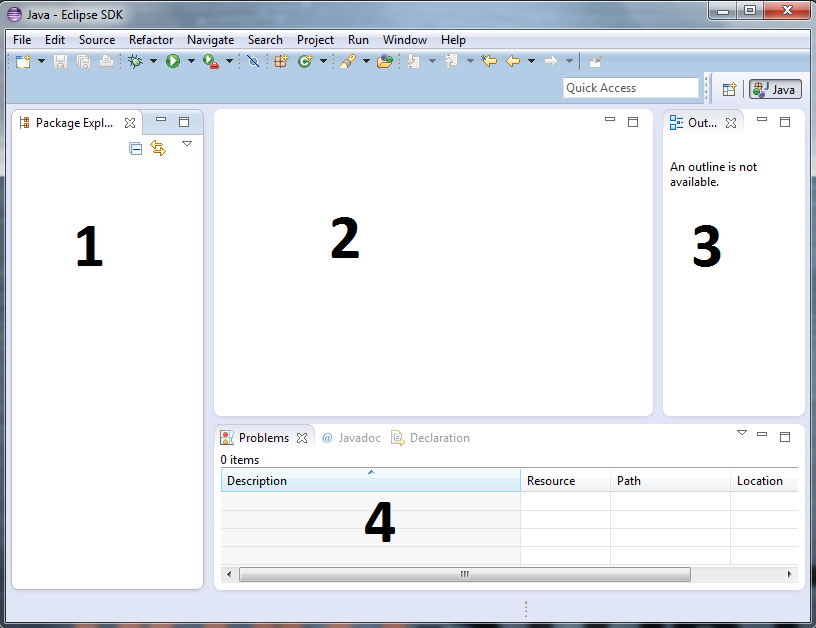
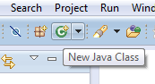
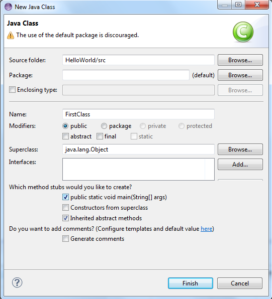
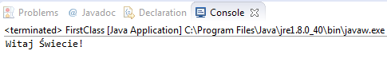

Wprowadzenie do języka Java
============================

W lekcji tej dowiesz się:
* jak używać środowiska eclipse
* co powstaje w wyniku kompilacji kodu źródłowego napisanego w języku Java
* jak uruchamiać swoje programy
* czym są zmienne
* jakie są podstawowe typy danych w Javie
* jak wykonywać podstawowe operacje arytmetyczne

Podczas lekcji nauczyciel powinien krótko omawiać daną sekcję pod względem teoretycznym, a następnie omawiać prezentowane przykłady, prosząc z wyprzedzeniem uczniów o sugestie tego jak zapisać dalszy fragment kodu źródłowego. Uczniowie powinni pisać kod jednocześnie na swoich komputerach, aby móc obserwować wynik działania aplikacji. Lekcja kończy się zadaniem do samodzielnego wykonania, które należy wykonać na zajęciach lub dokończyć samodzielnie w domu.

Eclipse IDE
------------

Eclipse to najpopularniejsze środowisko programistyczne wśród programistów Java. Jego głównymi zaletami z punktu widzenia osoby początkującej jest wykrywanie błędów w trakcie pisania kodu a także podpowiadanie składni wraz z możliwością generowania i prostej modyfikacji (refaktoryzacji) kodu źródłowego. Wszystko to składa się przede wszystkim na znaczną oszczędność czasu.

Przy pierwszym uruchomieniu środowiska zostaniemy zapytani o wskazanie folder "workspace" - jest to folder, w którym przechowywane będą tworzone przez nas projekty. Zalecamy zostawić tę lokalizację domyślną.

Na powyższym zrzucie ekranu widać domyślny widok, który zastaniemy po uruchomieniu środowiska eclipse. Można w nim wyróżnić 4 główne obszary:

#. Package Explorer - w tym miejscu będziemy widzieli wszystkie projekty, które zapisane są w folderze **workspace** oraz ich strukturę w postaci rozwijanego drzewa
#. Obszar oznaczony numerem 2 to główna część robocza - w tym miejscu będziemy edytowali kod źródłowy aplikacji
#. Outline - to skrótowy podgląd danego pliku i elementów w nim zawartych (zmienne, metody/funkcje)
#. W dolnej części ekranu znajduje się kilka zakładek. Najważniejsza z nich to **Problems**, która pokazuje wszelkie błędy i ostrzeżenia występujące w kodzie źródłowym. W tym miejscu zobaczymy także dodatkową zakładkę **Console** z wydrukami generowanymi przez nasze aplikacje.

Pierwszy Projekt
-----------------

W celu utworzenia nowego projektu wybieramy opcje **File -> New -> Java Project**

.. image:: 01_wprowadzenie/eclipse_first_project.png
    :align: center

Wpisujemy dowolną nazwę projektu w polu **Project name** a także wybieramy wersję maszyny wirtualnej (JRE), na jakiej ma być uruchomiony nasz program (domyślnie JavaSE-1.8). Klikamy Finish.

W obszarze Project Explorer pojawi się nowo utworzony projekt:

.. image:: 01_wprowadzenie/hello_world.png
    :align: center

Widzimy tu folder **src**, w którym umieszczane będą pliki z kodem źródłowym, a także dołączoną wirtualną maszynę, na której nasz projekt będzie uruchamiany.

Teraz należy utworzyć plik, w którym będziemy edytowali kod źródłowy. W dalszej częściu kursu będziemy mówili krótko o tworzeniu nowej **klasy**. Klasa jest pojęciem związanym z programowaniem obiektowym, które będzie głównym zagadnieniem kolejnej lekcji.

Kliknij prawym przyciskiem na folderze src i wybierz opcję **New -> Class**. Można także posłużyć się wygodnym skrótem i skorzystać z przycisku z symbolem C, który znajdziemy na górnym pasku nawigacyjnym.

W kreatorze klasy wymagane jest podanie jedynie nazwy klasy. My jednak zaznaczymy także opcję przy **public static void main(String[] args)**.

.. note::
    Nazwy klas rozpoczynaj zawsze wielką literą a jeżeli nazwa składa się z kilku wyrazów to je także rozpoczynaj wielką literą, np. NazwaTwojejKlasy albo ThisIsMyClass. Pamiętaj także, że nazwa klasy musi być identyczna z nazwą pliku, w którym ta klasa się znajduje (eclipse zadba o to automatycznie).

W naszym przypadku nazwą klasy jest **FirstClass**.

.. attention::
    Zapamiętaj, że w Javie nazwy klas i wielkość używanych liter, mają znaczenie. "NazwaKlasy" i "nazwaKlasy" będą potraktowane jako dwa zupełnie różne elementy.

W utworzonej przez nas klasie został wygenerowany następujący kod źródłowy:

.. code-block:: java
    :linenos:

    public class FirstClass {
    
      public static void main(String[] args) {
        // TODO Auto-generated method stub
        System.out.print("Witaj Świecie!");
      }
    
    }

W linii 1 widzimy definicję klasy. Klasę definiujemy za pomocą słowa kluczowego **class**, po którym następuje nazwa klasy. Eclipse automatycznie oznacza klasę jako publiczną za pomocą słowa kluczowego **public**, co najprościej można wytłumaczyć jako możliwość jej wykorzystania z dowolnego miejsca w naszym projekcie.

W wierszu 3 widzimy zapis *public static void main(String[] args)*, czyli publiczną, statyczną metodę o nazwie **main**, która nie zwraca żadnego wyniku (void). Element umieszczony w nawiasie, czyli *String[] args* to argument metody main w postaci tablicy - więcej na ten temat powiemy w 3 lekcji.

.. note::
    Zapamiętaj, że od metody main rozpoczyna się działanie każdej aplikacji napisanej w języku Java. Jeżeli nie zdefiniujesz takiej metody w swojej klasie, to nie będziesz w stanie uruchomić aplikacji.

Zauważ, że zarówno definicja klasy jak i metody rozpoczyna się i końcy nawiasami klamrowymi. Nawiasy klamrowe znacznie podnoszą czytelność kodu, szczególnie, gdy klasa składa się z kilkuset, czy nawet kilku tysięcy wierszy.

W metodzie main znajduje się jeden wiersz komentarza poprzedzony znakiem podwójnego ukośnika.

.. note::
    Komentarze w języku Java można zapisywać na dwa sposoby. Jeżeli komentarz ma zajmować jedynie jeden wiersz poprzedź go znakiem podwójnego ukośnika. Jeżeli będzie dłuższy umieść komentarz w bloku /* komentarz */ Komentarze są pomijane w trakcie kompilacji programu i nie mają wpływu na działanie aplikacji.
	
Po komentarzu dopisaliśmy także linijkę o treści **System.out.print("Witaj Świecie");**, która wydrukuje na ekranie tekst podany w nawiasie, czyli Witaj Świecie.

.. note::
    Zapamiętaj, że każda linijka z wyrażeniem (np. drukowaniem tekstu) w języku Java musi kończyć się średnikiem.

W celu uruchomienia programu wybierz z górnego paska nawigacyjnego charakterystyczny przycisk z symbolem strzałki (Run) lub po prostu użyj skrótu klawiaturowego **Ctrl+F11**.

W tym momencie w dolnej części eclipse powinno się pojawić okno konsoli (Console) z wydrukiem naszego tekstu.

Typy danych
------------

W Javie tak jak w praktycznie każdym języku programowania istnieją różne typy danych. **Typ danych** to opis tego co reprezentuje dana wartość. Z powodu budowy komputera rozróżnia się liczby całkowite, liczby zmiennoprzecinkowe, znaki, ciągi znaków.

* boolean - typ logiczny. Może przyjmować jedynie dwie wartości - true (prawda) lub false (fałsz).
* byte, short, int, long - typy całkowitoliczbowe. Różnią się zakresem wielkości liczby jakie mogą przechowywać (od najmniejszego do największego) - np. 1, 5, 10, 3456.
* float, double - typy zmiennoprzecinkowe o różnym zakresie (double może przechowywać większe liczby). Separatorem dziesiętnym jest kropka, np. 3.14, 276.24563.
* char - typ znakowy, reprezentuje pojedyncze litery lub znaki. Wartości tego typu umieszczamy pomiędzy znakami pojedynczego cudzysłowu, np. 'a', '&'.
* String - (pisany z wielkie litery) - specjalny typ, który służy do przechowywania ciągów znaków. Ciągi znaków zapisujemy pomiędzy podwójnymi cudzysłowami, np. "Ania", "Jakiś dowolny tekst".

**Ćwiczenie**
Napisz program, który wydrukuje na ekranie następujące wartości (wykorzystaj różne typy danych):
::
  245
  123.456
  a
  Java jest cool

*plik DataTypes.java*

.. code-block:: java
    :linenos:

    public class FirstClass {
      public static void main(String[] args) {
        System.out.println(245);
        System.out.println(123.456);
        System.out.println('a');
        System.out.println("Java jest cool");
      }
    }

Zmienne
------------
Drukowanie danych, na których nie możemy wykonywać żadnych działań, czy po prostu zapamiętać w pamięci komputera nie byłoby zbyt użyteczne. Na szczęście w Javie możemy tworzyć tzw. **zmienne**, czyli takie elementy, które pozwalają na przechowywanie wartości różnych typów danych. Java w odróżnieniu od np. PHP jest językiem statycznie typowanym co oznacza, że zmienna musi mieć określony typ - jeżeli chcesz przechowywać w niej wartość zmiennoprzecinkową, to nie możesz jej zadeklarować jako int, ponieważ spowoduje to błąd kompilacji.

Tworzenie zmiennej możemy podzielić na dwa etapy:

* deklarację - w tym momencie następuje zaalokowanie pamięci w komputerze
* inicjalizację (inicjację) - w tym momencie następuje przypisanie konkretnej wartości do zmiennej

Dwa wyżej wspomniane etapy mogą być od siebie oddzielone lub też można je połączyć ze sobą.

*plik Variables.java*

.. code-block:: java
    :linenos:

    public class Variables {
      public static void main(String[] args) {
        // deklaracja zmiennych różnego typu
        int x;
        double num;
        char letter;
        String napis;

        // inicjalizacja zmiennych
        x = 5;
        num = 12.67;
        letter = 'b';
        napis = "To może być bardzo długie zdanie";

        // deklaracja połączona z inicjalizacją
        int y = 15;
        String zdanie = "To jest przykładowe zdanie";
      }
    }

**Ćwiczenie**
Napisz program podobny do tego z poprzedniego zadania - wydrukuj na ekranie kilka wartości różnego typu, ale tym razem skorzystaj także ze zmiennych.

*plik DataTypesVars.java*

.. code-block:: java
    :linenos:
	
    public class DataTypesVars {
      public static void main(String[] args) {
        int num1 = 123;
        double num2 = 567.123;
        char b = 'b';
        String name = "Jan Kowalski";
        
        System.out.println(num1);
        System.out.println(num2);
        System.out.println(b);
        System.out.println(name);
      }
    }

Operacje arytmetyczne i logiczne
--------------------------------
Jednymi z najważniejszych elementów w jakich wykorzystujemy komputery są obliczenia. Nie zawsze muszą to być skomplikowane rachunki matematyczne - czasami chcemy coś po prostu przesunąć o 1 piksel w prawo na ekranie (np. w grach), a innym razem zwiększyć wiek użytkownika o 1, gdy ma urodziny.

W języku Java znajdziemy wszystkie najpopularniejsze operatory arytmetyczno logiczne:

* **+, -** - dodawanie i odejmowanie liczb
* **\*, /** - mnożenie i dzielenie całkowite liczb
* **%** - dzielenie modulo (reszta z dzielenia)
* **&&** - alternatywa logiczna. Tylko PRAWDA && PRAWDA da w wyniku PRAWDA
* **||** - alternatywa logiczna. Co najmniej jedna składowa musi być PRAWDĄ, aby wynik całego wyrażenia był prawdą. PRAWDA||PRAWDA lub PRAWDA||FAŁSZ lub FAŁSZ||PRAWDA ale nie FAŁSZ||FAŁSZ
* **>, >=, <, <=** - porównania. Większe, większe lub równe, mniejsze, mniejsze lub równe.

Wyniki wyrażeń arytmetyczno logicznych mogą być obliczane na podstawie zmiennych lub wartości, a także przypisywane do innych zmiennych.

*plik Arithmetic.java*

.. code-block:: java
    :linenos:

    public class Arithmetic {
      public static void main(String[] args) {
        int num1 = 5;
        int num2 = 3;
        //jaki jest wynik działania num1*num2 ?
        int num3 = num1 * num2;
        System.out.println(num3);
        
        //czy zmienna num1 jest większa od 3 ?
        boolean validate = num1 > 3;
        System.out.println(validate);
      }
    }

Znak dodawania (+) ma również specjalne zastosowanie w przypadku ciągów znaków (typ String). Powoduje on złączenie (konkatenację) dwóch ciągów znaków i utworzenie na ich podstawie nowego napisu.

.. code-block:: java

    String napis = "Jan" + "Kowalski";

**Ćwiczenie**
Napisz prosty kalkulator. Zadeklaruj i zainicjuj dwie liczby typu zmiennoprzecinkowego a następnie wyświetl na ekranie wynik ich dodawania, odejmowania, mnożenia i dzielenia. Dodatkowo wyświetl na ekranie, czy pierwsza z liczb jest większa od drugiej, a także, czy ich iloczyn jest większy od 100.
Przykładowy wydruk programu:
::
  a + b = 28.3
  a - b = 18.7
  a * b = 112.8
  a / b = 4.895833333333334
  A > B ?true
  A * B > 100 ? true

*plik SimpleCalculator.java*

.. code-block:: java
    :linenos:

    public class SimpleCalculator {
      public static void main(String[] args) {
        double a = 23.5;
        double b = 4.8;
        
        System.out.println("a + b = " + (a + b));
        System.out.println("a - b = " + (a - b));
        System.out.println("a * b = " + (a * b));
        System.out.println("a / b = " + (a / b));
        System.out.println("A > B ?" + (a > b));
        System.out.println("A * B > 100 ? " + (a*b > 100));
      }
    }

.. _Centrum Edukacji Obywatelskiej: http://www.ceo.org.pl/